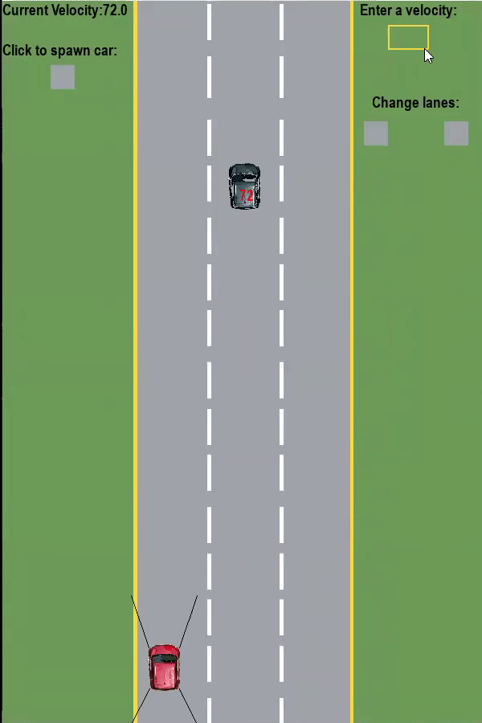

# EcoCAR - Vehicle Detection and Collision Prevention

The purpose of this project was to implement a simple collision detection and prevention algorithm for a car travelling on a three lane highway. The simulated car will prevent collisions by monitoring the distance and speed neighbouring vehicles. This project was originally created as a submission for EcoCAR at McMaster University. 

Requirements to run:
- [python3](https://www.python.org/downloads/)
- [pygame](https://www.pygame.org/download.shtml)

Once you have both of these installed just run the display.py file and the demo will pop up with the prompt to start.

## Group Member
- [Justin Rosner](https://github.com/justinrosner)
- [Janek Wolos]()
- [Justin Prez](https://github.com/justinprez)
